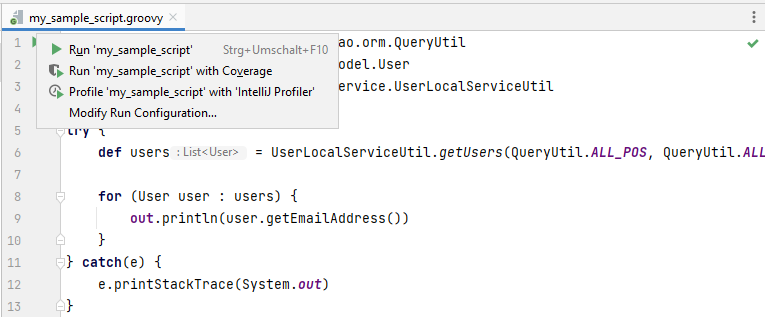

Groovy Scripts
==============

1. [Implicit Variables](#implicit-variables)
2. [Running Groovy scripts on Liferay Server](#running-groovy-scripts-on-liferay-server)

Implicit Variables
------------------

In Liferay you can use groovy script in the admin console. Some variables are implicitly available
in those scripts. This plugin offers those implicit variables, so that code completion etc. works.

The following implicit variables are provided for groovy files:

    out
    actionRequest
    actionResponse
    portletConfig
    portletContext
    portletRequest
    portletResponse
    preferences
    renderRequest
    renderResponse
    resourceRequest
    resourceResponse
    userInfo

Running Groovy scripts on Liferay Server
----------------------------------------

It is possible to run groovy scripts from IntelliJ directly on a running Liferay Server.

To be able to run scripts the Gogo Shell must be available via telnet. For Liferay 7.1 and above,
the developer properties must be enabled to expose the Gogo Shell on port 11311.

In IntelliJ just open the groovy file and click on the run marker at the top of the file.
Additional settings can be made by creating a Run Configuration of type **Liferay Remote Groovy**.

The results of the script executions are shown in the console.

If an error occurs and your script prints a stacktrace you can also click on the
error message in the console to directly open your script file at the erroneous location. 

**Known Issue:** Running groovy scripts in Liferay 7.4 (between 7.4.3.46 and 7.4.3.97) is currently not working properly (see https://liferay.atlassian.net/browse/LPS-106390).

*This feature requires Java 11 or higher.*
