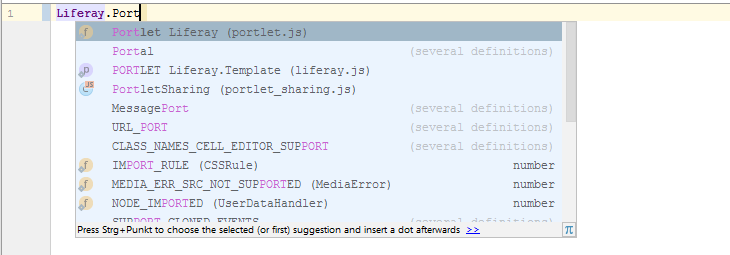
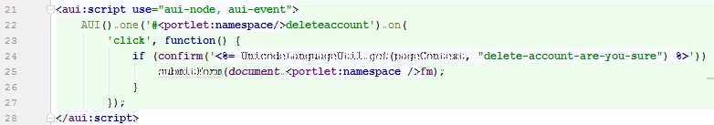

JavaScript
==========

1. [Predefined JavaScript Libraries](#predefined-javascript-libraries)
2. [JavaScript injection for taglibs](#javascript-injection-for-taglibs)
3. [JavaScript support for liferay-look-and-feel.xml](#javascript-support-for-liferay-look-and-feel.xml)

Predefined JavaScript Libraries
-------------------------------

The plugin provides predefined JavaScript Libraries for AlloyUI and Liferay barebone files. By this, code completion works
for JavaScript variables like ```AUI()``` or ```Liferay```.



*This feature works in IntelliJ Ultimate Edition only.*

*To lookup AlloyUI or Liferay Javascript files you need to add a dependency to ```portal-web``` (Liferay 6.x) or to 
```com.liferay.frontend.js.web``` and ```com.liferay.frontend.js.aui.web``` (Liferay 7.x) somewhere in your project.*

JavaScript injection for taglibs
--------------------------------

When using the ``<aui:script>``  or ``<aui:validator>`` tag in JSPs, the content is detected as JavaScript, so you can use all JavaScript features
like highlighting, syntax checking and code completions. This works for several attributes of AUI or Liferay tags, too, e.g. for ``<aui:a onClick="javascript">``.

The same applies to Freemarker templates. 



The following tag libraries are supported:

    <aui:>
    <liferay-frontend:>
    <liferay-ui:>
    

*This feature works in IntelliJ Ultimate Edition only.*

*To detect the tags, the namespaces must be declared properly, e.g.*

``` html
    <%@ taglib uri="http://liferay.com/tld/aui" prefix="aui" %>
```

JavaScript support for liferay-look-and-feel.xml
------------------------------------------------

Inside `<setting>` tags in a `liferay-look-and-feel.xml` you can use JavaScript to
add custom logic or validation rules.

This plugin injects JavaScript language into those tags, so code completion is available.

See https://liferay.dev/blogs/-/blogs/theme-settings-and-new-advanced-controls for more info about that feature.