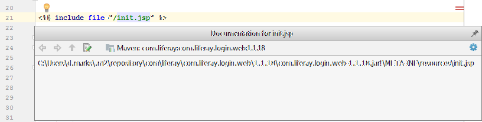

Editing JSP files
=================

## Description

Existing JSPs can be overridden by a *JSP Hook* (Liferay 6.x) or an *OSGi fragment* (Liferay 7 / DXP).

The plugin searches the *portal-web* (Liferay 6.x) or the *fragment-host* (Liferay 7 / DXP), so that ```<%@ include file=... %>``` can be resolved properly.

By this, references from the *original* JSPs can be resolved, code completion and syntax checking is possible.



In Liferay 7 / DXP the JSPs for your portlet are placed at ```META-INF/resources```. This plugin defines that folder as Web Root, so
absolute paths (e.g. for includes) are resolved properly. 

Several AUI tags provide attributes like ```cssClass``` or ```iconCssClass```. This plugins provides code completion features for this attribute, so that
(S)CSS classes are resolved properly.

## Requirements

This feature works in IntelliJ Ultimate Edition only.

To use references to a *fragment-host* (Liferay 7 / DXP), the corresponding library must be present in your module (e.g. dependency declaration in Ivy, Maven or Gradle).

To resolve references for *JSP Hooks* (Liferay 6.x), the library ```portal-web``` must be present in your module (e.g. dependency declaration in Ivy, Maven or Gradle).

