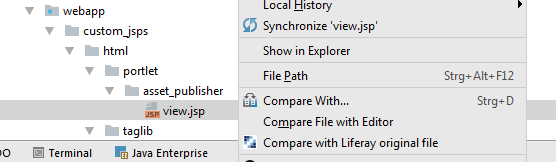
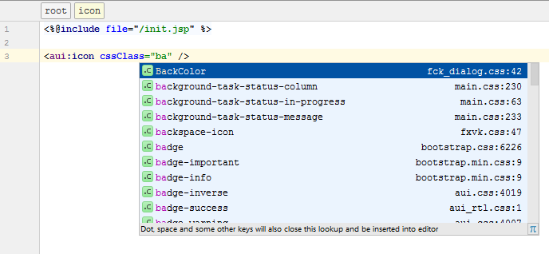
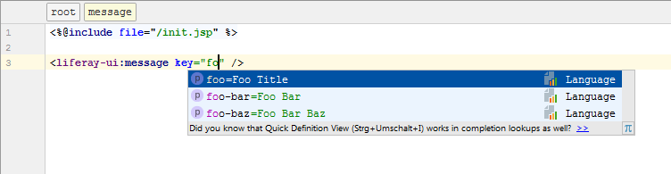
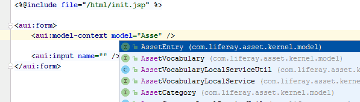
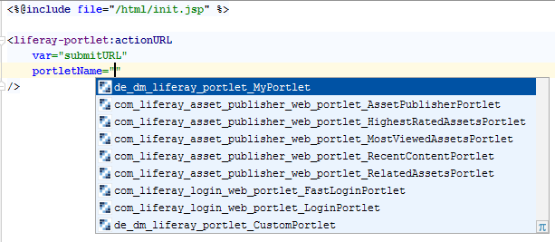
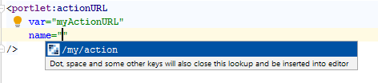
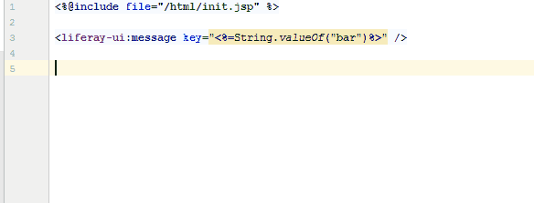
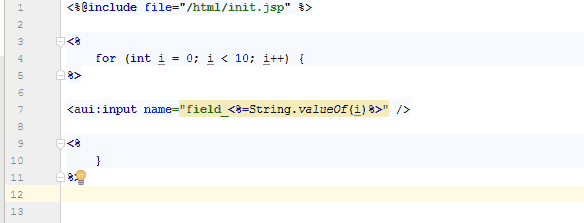
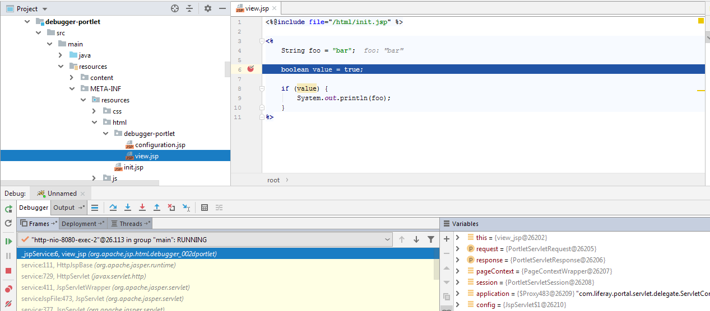
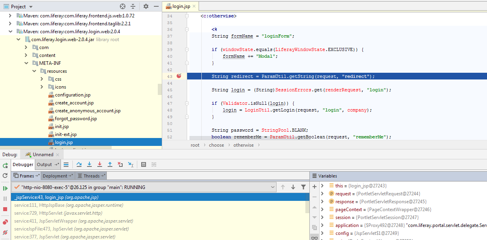

JSP files
=========

1. [Resolve includes to JSPs inside JSP Hooks](#resolve-includes-to-jsps-inside-jsp-hooks)
2. [Compare JSP with original JSP inside JSP Hooks](#compare-jsp-with-original-jsp-inside-jsp-hooks)
3. [Detecting META-INF/resources as web content roots](#detecting-meta-infresources-as-web-content-roots)
4. [Code completions for Liferay taglibs](#code-completions-for-liferay-taglibs)
5. [JSP inspections](#jsp-inspections)
6. [Debugger support for JSPs](#debugger-support-for-jsps) 
7. [Suggested Parents](#suggested-parent)

Resolve includes to JSPs inside JSP Hooks
-----------------------------------------

Existing JSPs can be overridden by a *JSP Hook* (Liferay 6.x) or an *OSGi fragment* (Liferay 7 / DXP).

The plugin searches the *portal-web* (Liferay 6.x) or the *fragment-host* (Liferay 7 / DXP), so that ```<%@ include file=... %>``` can be resolved properly.
For Liferay 7 / DXP this works for core jsp hooks, too.

By this, references from the *original* JSPs can be resolved, code completion and syntax checking is possible.


*This feature works in IntelliJ Ultimate Edition only.*

*To use references to a fragment-host (Liferay 7 / DXP), the corresponding library must be present in your module (dependency declaration in Ivy, Maven or Gradle).*

*To use references for a core jsp hook (Liferay 7 / DXP), the library ```com.liferay.portal:com.liferay.portal.web``` must be present in your module (dependency declaration in Ivy, Maven or Gradle).*

*To resolve references for JSP Hooks (Liferay 6.x), the library ```portal-web``` must be present in your module (dependency declaration in Ivy, Maven or Gradle).*
 

Compare JSP with original JSP inside JSP Hooks
----------------------------------------------

You can compare your JSP with the original Liferay file to see what has been changed. This works for JSP Hooks (Liferay 6.x) and OSGi fragments (Liferay 7 / DXP).




*This feature works in IntelliJ Ultimate Edition only.*

*To use references to a fragment-host (Liferay 7 / DXP), the corresponding library must be present in your module (dependency declaration in Ivy, Maven or Gradle).*

*To resolve references for JSP Hooks (Liferay 6.x), the library ```portal-web``` must be present in your module (dependency declaration in Ivy, Maven or Gradle).*

Detecting META-INF/resources as web content roots
-------------------------------------------------

In Liferay 7 / DXP the JSPs for your portlet are placed at ```META-INF/resources```. This plugin defines that folder as Web Root, so
absolute paths (e.g. for includes) are resolved properly. The same applies for core JSP hooks (Liferay 7).

Code completions for Liferay taglibs
------------------------------------

Several Liferay or AUI tags provide attributes like ```cssClass``` or ```iconCssClass```. This plugin provides code completion features for this attribute, so that
(S)CSS classes are resolved properly.



Many attributes for Liferay or AUI tags refer to keys inside language resource bundles. This plugin adds code completion features for those
attributes.



Additionally, you can search for classnames and java bean properties in specific tags like `<aui:model-context>` or `<aui:input>`.



For some taglibs you can automatically complete defined Portlet Names. Those are fetched from the `javax.portlet.name` property in your portlet classes.



Additionally, you can auto-complete action commands, render command and resource commands to
`<portlet:actionURL>`, `<portlet:renderURL>` and `<portlet:resourceURL>`.   



The following tag libraries are supported:
 
    <aui:>
    <clay:>
    <portlet:>
    <liferay-adaptive-media:>
    <liferay-asset:>  
    <liferay-comment:>
    <liferay-ddm:>
    <liferay-document-library:>
    <liferay-editor:>
    <liferay-expando:>
    <liferay-export-import-changeset:>
    <liferay-flags:>
    <liferay-frontend:>
    <liferay-item-selector:>
    <liferay-journal:>
    <liferay-portlet:>
    <liferay-product-navigation:>
    <liferay-security:>
    <liferay-sharing:>
    <liferay-site:>
    <liferay-staging:>
    <liferay-trash:>
    <liferay-ui:>
    
 
JSP inspections
--------------- 
 
Using double quotes inside taglib attributes are not permitted. A configurable inspection is provided
which checks for this case and offers a quick fix to use single quotes instead.



The same applies to string concatenation inside taglib attributes. Concatenation with
JSP expressions do not work. An inspection shows this problem and offers a quick fix to wrap the whole
attribute inside a JSP expression.



 
Debugger support for JSPs
-------------------------

This plugin adds (experimental) support to debug JSPs. 

It does not matter if you run a "Tomcat" Run Configuration or if you start Tomcat externally and
attach a remote debugger. 

This works for JSPs in your own modules and even for JSPs inside any Liferay dependency you are using.

 



Suggested Parents
-----------------

For some taglibs the plugin detects if they are used in the correct context. Specific tags should be used 
inside other tags, only. E.g. an `<aui:input>` should be used inside an `<aui:form>` only.

The plugin detects such a situation and shows a warning if a tag is not used in the right context. 
The warning (inspection) can be disabled if desired.

The following tags are checked for the right context:

    <aui:input>
    <aui:nav-bar-search>
    <aui:nav-item>
    <aui:nav>
    <liferay-ui:organization-search-container-results>
    <liferay-ui:panel>
    <liferay-ui:search-container-column-date>
    <liferay-ui:search-container-column-icon>
    <liferay-ui:search-container-column-image>
    <liferay-ui:search-container-column-jsp>
    <liferay-ui:search-container-column-status>
    <liferay-ui:search-container-column-text>
    <liferay-ui:search-form>
    <liferay-ui:section>
    <liferay-ui:user-group-search-container-results>
    <liferay-ui:user-search-container-results>
    <liferay-portlet:param>