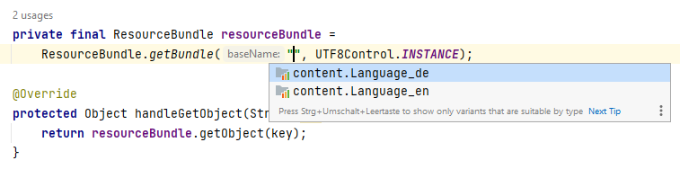

Language Support
================

1. [Resolve Resource Bundles](#resolve-resource-bundles)

Resolve Resource Bundles
------------------------

If you want to load Resource files you can refer to `Language_xx.properties` files. This
plugin allows you to resolve those files and adds code completion in some Java methods, e.g.




The following method calls are supported:

```
java.util.ResourceBundle.getBundle()
com.liferay.portal.kernel.util.ResourceBundleUtil.getBundle()
com.liferay.portal.kernel.util.ResourceBundleUtil.getLocalizationMap()
```