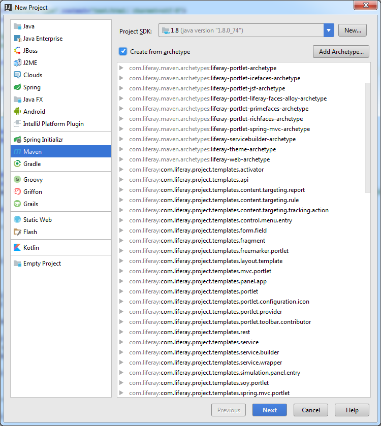

Creating new modules
====================

1. [Maven Archetypes](#maven-archetypes)

Maven Archetypes
----------------

This plugin provides you with the official Liferay Maven Archetypes.

When creating new projects or modules, all Liferay Maven Archetypes are available.

*To make this working, the [Maven Archetype Catalog](https://plugins.jetbrains.com/plugin/7965-maven-archetype-catalogs) plugin is required.*
