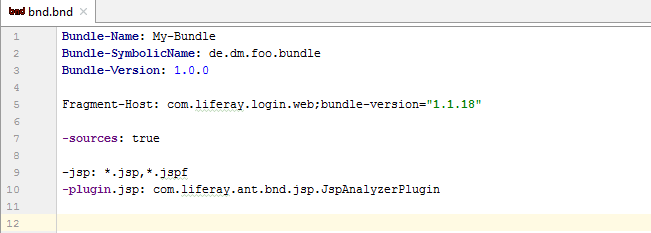
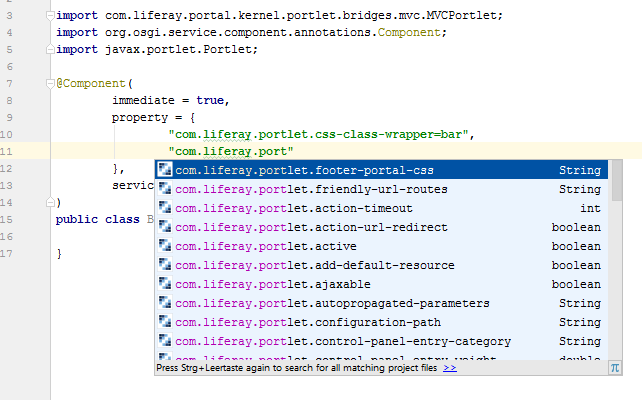

OSGi components
===============

1. [Syntax Hightlighting for BND files](#syntax-hightlighting-for-bnd-files)
2. [Component annotation code completion](#component-annotation-code-completion)
3. [Implicit usage for Reference annotations](#implicit-usage-for-reference-annotations)

Syntax Hightlighting for BND files
----------------------------------

This plugin adds basic syntax highlighting for ```bnd.bnd``` files.



*Works for Liferay 7.x, works in IntelliJ Community Edition and Ultimate Edition*

Component annotation code completion
------------------------------------

This plugin adds basic code completions for the ```@Component``` annotations, so that known properties for Portlets and many other
Liferay components are provided. For several properties a quick documentation is provided (Ctrl-Q), so that
you can look up the meaning of those properties.



List of supported component classes:

    com.liferay.adaptive.media.handler.AMRequestHandler
    com.liferay.adaptive.media.image.counter.AMImageCounter
    com.liferay.adaptive.media.image.optimizer.AMImageOptimizer
    com.liferay.adaptive.media.image.scaler.AMImageScaler
    com.liferay.application.list.PanelApp
    com.liferay.application.list.PanelCategory
    com.liferay.asset.kernel.model.AssetRendererFactory
    com.liferay.asset.kernel.util.AssetEntryQueryProcessor
    com.liferay.asset.kernel.validator.AssetEntryValidator
    com.liferay.asset.kernel.validator.AssetEntryValidatorExclusionRule
    com.liferay.dynamic.data.mapping.form.field.type.DDMFormFieldType
    com.liferay.dynamic.data.mapping.form.field.type.DDMFormFieldValueAccessor
    com.liferay.dynamic.data.mapping.form.field.type.DDMFormFieldValueRenderer
    com.liferay.dynamic.data.mapping.form.field.type.DDMFormFieldValueRequestParameterRetriever
    com.liferay.dynamic.data.mapping.render.DDMFormFieldRenderer
    com.liferay.dynamic.data.mapping.util.DDMDisplay
    com.liferay.dynamic.data.mapping.util.DDMStructurePermissionSupport
    com.liferay.dynamic.data.mapping.util.DDMTemplatePermissionSupport
    com.liferay.expando.kernel.model.CustomAttributesDisplay
    com.liferay.exportimport.content.processor.ExportImportContentProcessor
    com.liferay.exportimport.kernel.controller.ExportImportController
    com.liferay.exportimport.kernel.lar.PortletDataHandler
    com.liferay.exportimport.kernel.lar.StagedModelDataHandler
    com.liferay.exportimport.portlet.preferences.processor.ExportImportPortletPreferencesProcessor
    com.liferay.exportimport.resources.importer.portlet.preferences.PortletPreferencesTranslator
    com.liferay.frontend.image.editor.capability.ImageEditorCapability
    com.liferay.frontend.taglib.form.navigator.context.FormNavigatorContextProvider
    com.liferay.item.selector.ItemSelectorView
    com.liferay.knowledge.base.web.internal.selector.KBArticleSelector
    com.liferay.mentions.matcher.MentionsMatcher
    com.liferay.portal.configuration.persistence.listener.ConfigurationModelListener
    com.liferay.portal.deploy.hot.CustomJspBag
    com.liferay.portal.editor.configuration.EditorOptionsProvider
    com.liferay.portal.kernel.atom.AtomCollectionAdapter
    com.liferay.portal.kernel.backgroundtask.BackgroundTaskExecutor
    com.liferay.portal.kernel.cache.configurator.PortalCacheConfiguratorSettings
    com.liferay.portal.kernel.captcha.Captcha
    com.liferay.portal.kernel.editor.configuration.EditorConfigContributor
    com.liferay.portal.kernel.events.LifecycleAction
    com.liferay.portal.kernel.messaging.Destination
    com.liferay.portal.kernel.messaging.MessageListener
    com.liferay.portal.kernel.model.ModelListener
    com.liferay.portal.kernel.model.LayoutTypeController
    com.liferay.portal.kernel.notifications.UserNotificationDefinition
    com.liferay.portal.kernel.notifications.UserNotificationHandler
    com.liferay.portal.kernel.portlet.AddPortletProvider
    com.liferay.portal.kernel.portlet.BrowsePortletProvider
    com.liferay.portal.kernel.portlet.ConfigurationAction
    com.liferay.portal.kernel.portlet.EditPortletProvider
    com.liferay.portal.kernel.portlet.FriendlyURLMapper
    com.liferay.portal.kernel.portlet.ManagePortletProvider
    com.liferay.portal.kernel.portlet.PortletLayoutFinder
    com.liferay.portal.kernel.portlet.PortletLayoutListener
    com.liferay.portal.kernel.portlet.PreviewPortletProvider
    com.liferay.portal.kernel.portlet.ViewPortletProvider
    com.liferay.portal.kernel.portlet.bridges.mvc.MVCActionCommand
    com.liferay.portal.kernel.portlet.bridges.mvc.MVCRenderCommand
    com.liferay.portal.kernel.portlet.bridges.mvc.MVCResourceCommand
    com.liferay.portal.kernel.portlet.configuration.icon.PortletConfigurationIcon
    com.liferay.portal.kernel.portlet.toolbar.contributor.PortletToolbarContributor
    com.liferay.portal.kernel.poller.PollerProcessor
    com.liferay.portal.kernel.repository.RepositoryFactory
    com.liferay.portal.kernel.scheduler.messaging.SchedulerEventMessageListener
    com.liferay.portal.kernel.search.Indexer
    com.liferay.portal.kernel.search.IndexerPostProcessor
    com.liferay.portal.kernel.search.IndexSearcher
    com.liferay.portal.kernel.search.IndexWriter
    com.liferay.portal.kernel.search.hits.HitsProcessor
    com.liferay.portal.kernel.search.suggest.QuerySuggester
    com.liferay.portal.kernel.security.auth.Authenticator
    com.liferay.portal.kernel.security.auth.AuthFailure
    com.liferay.portal.kernel.security.permission.BaseModelPermissionChecker
    com.liferay.portal.kernel.security.permission.PermissionUpdateHandler
    com.liferay.portal.kernel.security.permission.ResourcePermissionChecker
    com.liferay.portal.kernel.servlet.taglib.DynamicInclude
    com.liferay.portal.kernel.servlet.taglib.TagDynamicIdFactory
    com.liferay.portal.kernel.servlet.taglib.ui.FormNavigatorCategory
    com.liferay.portal.kernel.servlet.taglib.ui.FormNavigatorEntry
    com.liferay.portal.kernel.social.SocialActivityManager
    com.liferay.portal.kernel.struts.StrutsAction
    com.liferay.portal.kernel.struts.StrutsPortletAction
    com.liferay.portal.kernel.template.TemplateContextContributor
    com.liferay.portal.kernel.template.TemplateHandler
    com.liferay.portal.kernel.templateparser.TransformerListener
    com.liferay.portal.kernel.trash.TrashHandler
    com.liferay.portal.kernel.workflow.WorkflowEngineManager
    com.liferay.portal.kernel.workflow.WorkflowHandler
    com.liferay.portal.kernel.upgrade.UpgradeStep
    com.liferay.portal.kernel.util.ResourceBundleLoader
    com.liferay.portal.kernel.webdav.WebDAVStorage
    com.liferay.portal.language.LanguageResources
    com.liferay.portal.output.stream.container.OutputStreamContainerFactory
    com.liferay.portal.search.analysis.FieldQueryBuilderFactory
    com.liferay.portal.search.buffer.IndexerRequestBufferExecutor
    com.liferay.portal.search.buffer.IndexerRequestBufferOverflowHandler
    com.liferay.portal.search.elasticsearch6.internal.connection.ElasticsearchConnection
    com.liferay.portal.security.ldap.configuration.ConfigurationProvider
    com.liferay.portal.security.sso.openid.OpenIdProviderRegistry
    com.liferay.portal.struts.FindActionHelper
    com.liferay.portal.template.TemplateResourceParser
    com.liferay.portal.template.TemplateManager
    com.liferay.portal.verify.VerifyProcess
    com.liferay.portal.workflow.kaleo.definition.parser.NodeValidator
    com.liferay.portal.workflow.kaleo.runtime.assignment.TaskAssignmentSelector
    com.liferay.portal.workflow.kaleo.runtime.notification.NotificationSender
    com.liferay.portal.workflow.kaleo.runtime.notification.recipient.NotificationRecipientBuilder
    com.liferay.portlet.documentlibrary.store.Store
    com.liferay.portlet.documentlibrary.store.StoreWrapper
    com.liferay.product.navigation.control.menu.ProductNavigationControlMenuEntry
    com.liferay.push.notifications.sender.PushNotificationsSender
    com.liferay.social.kernel.model.SocialActivityInterpreter
    com.liferay.social.kernel.model.SocialRequestInterpreter
    com.liferay.sync.internal.jsonws.SyncDLObject
    com.liferay.wiki.importer.WikiImporter
    java.lang.Object
    java.util.ResourceBundle
    javax.management.DynamicMBean
    javax.portlet.Portlet
    javax.portlet.filter.PortletFilter
    javax.servlet.Filter
    javax.servlet.Servlet
    javax.websocket.Endpoint
    org.eclipse.osgi.service.urlconversion.URLConverter
    org.osgi.service.http.context.ServletContextHelper

*Works for Liferay 7.x, works in IntelliJ Community Edition and Ultimate Edition*

Implicit usage for Reference annotations
----------------------------------------

Injected component references using the ```@Reference``` annotation are marked as "unused" by IntelliJ by default.
This plugin tells IntelliJ that those are injected references, so that they are actually "written" somehow and
so they are not "unsued".

List of supported annotations:
    
    org.osgi.service.component.annotations.Reference
    org.osgi.service.component.annotations.Activate
    org.osgi.service.component.annotations.Deactivate
    org.osgi.service.component.annotations.Modified
    com.liferay.portal.spring.extender.service.ServiceReference
    com.liferay.portal.kernel.bean.BeanReference
    com.liferay.arquillian.containter.remote.enricher.Inject
    com.liferay.arquillian.portal.annotation.PortalURL
    org.jboss.arquillian.core.api.annotation.Inject

*Works for Liferay 7.x, works in IntelliJ Community Edition and Ultimate Edition*
