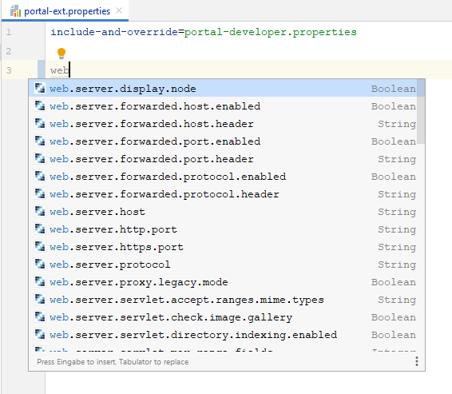

portal.properites
=================

1. [Code Completion and documentation](#code-completion-and-documentation)

Code Completion and documentation
---------------------------------

For all `portal.properties` files (e.g. all files starting with `portal` and ending with `.properties`) code
completion is available. When editing such files all available properties are suggested.

Additonally you can lookup the documentation (Quick documentation lookup, `Ctrl-Q`).

*Works for Liferay 7.x, works in IntelliJ Community Edition and Ultimate Edition*