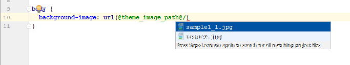
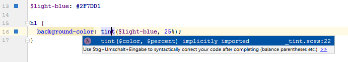
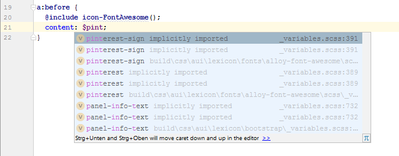
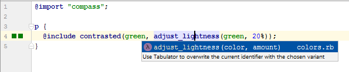
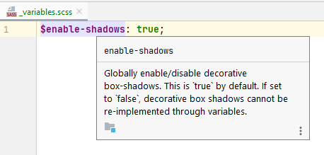
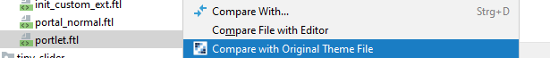

CSS / SCSS files
================

1. [Theme Image Path reference](#theme-image-path-reference)
2. [Bourbon Library](#bourbon-library)
3. [Theme Inheritance](#theme-inheritance)
4. [Compass Support](#compass-support)
5. [Clay SCSS Variables documentation](#clay-scss-variables-documentation)
6. [Frontend Token Definition support](#frontend-token-definition-support)
7. [Compare Theme files with original files](#compare-theme-files-with-original-files)

Theme Image Path reference
--------------------------

References to images can use the placeholder ```@theme_image_path@```. This plugin tells IntelliJ where
this folder is present in your Theme, so that you can use code completion and jump to the images. The plugin
will check the ```images-path``` property in your ```liferay-look-and-feel.xml``` to find the correct folder.



**Known Issue:** In CSS files (not SCSS) the ``@theme_image_path@`` reference works, but is shown as an error in IntelliJ IDEA.


Bourbon library
---------------

For Liferay 7 / DXP the *css-frontend-common* library is available in Theme SCSS files. This plugin makes it available
in IntelliJ, so that you can use the provided Mixins or Bourbon functions.



*This feature works in IntelliJ Ultimate Edition only.*

*To use references to css-frontend-common, this library must be present in your module (e.g. dependency declaration in Ivy, Maven or Gradle).*

Theme Inheritance
-----------------

If you inherit from the parent theme *_styled* or *_unstyled*, this plugin provides these to IntelliJ. So you
can use references and code completion features.



*This feature works in IntelliJ Ultimate Edition only.*

*To use references to the parent theme in Liferay 7 / DXP, those libraries must be present in your module (e.g. dependency declaration in Ivy, Maven or Gradle).*

*To use references to the parent theme in Liferay 6.x, a reference to ```portal-web``` must be present in your module (e.g. dependency declaration in Ivy, Maven or Gradle).*

Compass Support
---------------

Liferay 6.1 and 6.2 use the Compass library. This plugin creates a Compass library, so that functions and mixins can be resolved.



*This feature works in IntelliJ Ultimate Edition only.*

Clay SCSS Variables documentation
---------------------------------

Some Clay SCSS variable declarations are provided with a Quick Documentation (Ctrl-Q).



*This feature works in IntelliJ Ultimate Edition only.*


Frontend Token Definition support
---------------------------------

To customize your theme, Liferay offers you to define style books using a `frontend-token-definition.json` file.

This plugin provides a JSON schema for that file, so that code completion and validation is available. 

Additionally, all `label` attributes are references to `Language_xx.properties` files, so that you can
look up language keys while editing that file.

*This feature works in IntelliJ Ultimate Edition only.*

Compare Theme files with original files
---------------------------------------

When you inherit from a parent theme (e.g. `styled` or `unstyled`) you can now 
compare your files with the original files from the parent theme. This works for inheritance of
custom themes, too.


