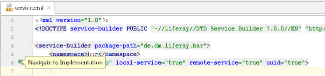
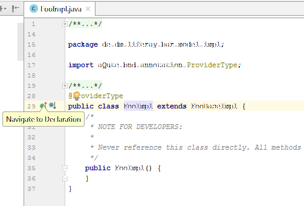

Service XML
===========

Liferay Services are defined in ```service.xml```

## Description

This plugin adds a line marker to the ```service.xml``` for each entity. Using this marker you can jump to 
the generated Model Implementation Java class. 



Within the Java class you can jump back to the declaration in the ```service.xml```.



## Requirements

Should work without any special requirements.