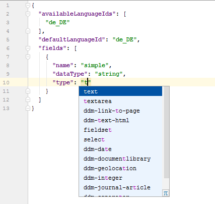

Structures, Templates and Application Display Templates
=======================================================

1. [Implicit variables for Journal Templates](#implicit-variables-for-journal-templates)
2. [Implicit Journal Structure variables](#implicit-journal-structure-variables)
3. [JSON Schema](#json-schema)
4. [Implicit variables for Application Display Templates](#implicit-variables-for-application-display-templates)
5. [Live Template scopes](#live-template-scopes)
6. [Implicit Variables for Workflow Definition Templates](#implicit-variables-for-workflow-definition-templates)

Implicit variables for Journal Templates
----------------------------------------

Journal Templates can use Velocity or Freemarker. This plugin defines implicit variables which are usable in those files.


*This feature works in IntelliJ Ultimate Edition only.*

Implicit Journal Structure variables
------------------------------------

Variables defined in the corresponding structure are available. Structure files in XML (Liferay 6.x) and JSON (Liferay 7 / DXP) are supported. For
Liferay 7.4 the new JSON structure based on the Data Engine implementation is supported, too. 
You can access nested structure variables and even access variables from a loop variable (Freemarker only).

A quick documentation popup is available which shows the name, the type, the label and the tip from the structure.


*This feature works in IntelliJ Ultimate Edition only.*

*The plugin expects Journal Structures and Templates to be present in the same structure as it would be required for the Resource Importer.
Have to a look at the [official documentation](https://dev.liferay.com/develop/tutorials/-/knowledge_base/7-0/importing-resources-with-a-theme) about which structure the Resource Importer expects.* 

JSON Schema
-----------

In Liferay 7.x Journal structures are saved as JSON files. This plugin provides a JSON schema for those files, so that
the files are validated and code completion is available. For
Liferay 7.4 the new JSON structure based on the Data Engine implementation is supported, too.



A JSON Schema is provided for the following files:

    Journal Structure Files
    assets.json
    sitemap.json
    frontend-token-definition.json

Implicit variables for Application Display Templates
----------------------------------------------------

Application Display Templates can use Velocity or Freemarker, too. This plugin defines implicit variables
depending on the type of the ADT, e.g. ```entry``` with the type of an ```AssetEntry``` for Asset Publisher ADTs.


The following Application Display Template types are supported:

    asset_entry
    asset_category
    asset_tag
    blogs_entry
    bread_crumb
    category_facet
    custom_facet
    custom_filter
    document_library
    folder_facet
    language_entry
    media_gallery
    modified_facet
    rss_feed
    search_bar
    search_results
    site_facet
    site_map
    site_navigation
    sort
    tag_facet
    type_facet
    user_facet
    wiki_page
 
*This feature works in IntelliJ Ultimate Edition only.*

*The plugin expects Application Display Templates to be present in the same structure as it would be required for the Resource Importer.*

Live Template scopes
--------------------

To be able to define specific live templates for Journal Templates or Application Display Templates
new scopes are available for the live templates.

The following scopes are available

    Liferay Application Display Templates (Freemarker)
    Liferay Journal Templates (Freemarker)
    Liferay Theme Template (Freemarker)
    Liferay Application Display Templates (Velocity)
    Liferay Journal Templates (Velocity)
    Liferay Theme Template (Velocity)

Implicit Variables for Workflow Definition Templates
----------------------------------------------------

Inside `<template>` tags and inside `<description>` tags within a `<notification>` tag in a workflow definition file Freemarker or Velocity can be used. In those tags
context variables like `workflowContext` are detected, so that code completion
is available for those variables.
