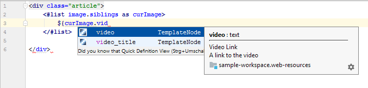

Editing Structures, Templates and Application Display Templates
===============================================================

If you have Journal Structures, Templates or Application Display Templates in your workspace, additional code completions are provided.

## Description

**Journal Templates** can use Velocity or Freemarker. This plugin defines implicit variables which are usable in those files.


Variables defined in the corresponding structure are available as well. Structure files in XML (Liferay 6.x) and JSON (Liferay 7 /DXP) are supported.
You can jump to the declaration in the structure file. 



**Application Display Templates** can use Velocity or Freemarker, too. This plugin defines implicit variables
depending on the type of the ADT, e.g. ```entry``` with the type of an ```AssetEntry``` for Asset Publisher ADTs.


## Requirements

This feature works in IntelliJ Ultimate Edition only.

The plugin expects Journal Structures and Templates to be present in the same structure as it would be required for the Resource Importer.
Have to a look at the [official documentation](https://dev.liferay.com/develop/tutorials/-/knowledge_base/7-0/importing-resources-with-a-theme) about which structure the Resource Importer expects. 

The plugin expects Application Display Templates to be present in the same structure as it would be required for the Resource Importer.