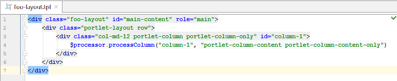
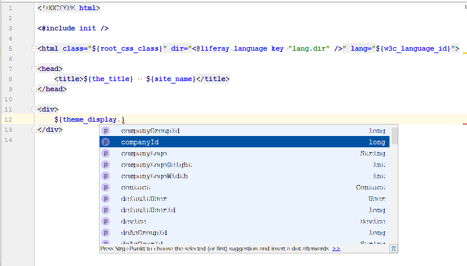
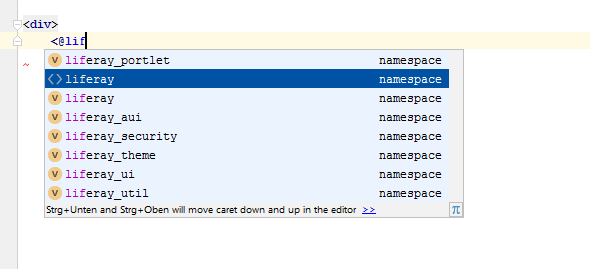
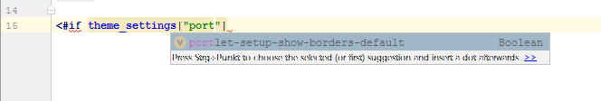
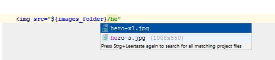
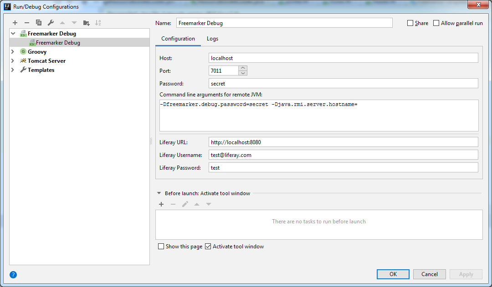

Velocity and Freemarker
=======================

1. [Liferay Layout Templates](#liferay-layout-templates)
2. [Implicit variables for Liferay Themes](#implicit-variables-for-liferay-themes)
3. [Special helper variables for Freemarker](#special-helper-variables-for-freemarker)
4. [Freemarker taglibs](#freemarker-taglibs)
5. [Implicit Theme Settings variables](#implicit-theme-settings-variables)
6. [Implicit Theme Path variables](#implicit-theme-path-variables)
7. [Freemarker Debugger](#freemarker-debugger)
8. [Freemarker Imports](#freemarker-imports)
9. [Gulpfile](#gulpfile)
10. [Deprecations](#deprecations)

Liferay Layout Templates
------------------------

Liferay Layout template are defined in ``.tpl`` files. This plugin defines that those files should be handled as Velocity files, so
all Velocity features like highlighting, syntax checking and code completions are available.  



*This feature works in IntelliJ Ultimate Edition only.*

Implicit variables for Liferay Themes
-------------------------------------

Liferay Themes can be created with Freemarker or Velocity. This plugin defines implicit variables which are usable in those files.



*This feature works in IntelliJ Ultimate Edition only.*

Special helper variables for Freemarker
---------------------------------------

Additional support is available for special helper variables in Freemarker templates like ```serviceLocator```. 
You can look up appropriate class names and the returned object is detected as the correct class type.

The following variables are supported:

    enumUtil
    serviceLocator
    staticFieldGetter
    staticUtil
    objectUtil

*This feature works in IntelliJ Ultimate Edition only.*

Freemarker taglibs
------------------

Additionally basic Velocity and Freemarker macros are available. For Freemarker, known Liferay Taglibs are available as additional namespaces. 

If you are using ```<@aui:script>``` tags etc. the content is detected as Javascript, too.



The following taglibs are available:

    <@liferay_aui />
    <@liferay_portlet />
    <@portlet />
    <@liferay_security />
    <@liferay_theme />
    <@liferay_ui />
    <@liferay_util />
    <@adaptive_media_image />
    <@liferay_asset />
    <@chart />
    <@clay />
    <@liferay_comment />
    <@liferay_document_library />
    <@liferay_editor />
    <@liferay_expando />
    <@liferay_flags />
    <@lliferay-fragment />
    <@liferay_frontend />
    <@liferay_item_selector />
    <@liferay_journal />
    <@liferay_layout />
    <@liferay_map />
    <@liferay_product_navigation />
    <@liferay_reading_time />
    <@liferay_rss />
    <@liferay_sharing />
    <@liferay_site />
    <@liferay_site_navigation />
    <@liferay_social_activities />
    <@liferay_social_bookmarks />
    <@liferay_trash />
    
*This feature works in IntelliJ Ultimate Edition only.*

Implicit Theme Settings variables
---------------------------------

If you have defined custom theme settings in your ```liferay-look-and-feel.xml``` those are provided for code completion, too. You can jump
to the declaration in the ```liferay-look-and-feel.xml```.



*This feature works in IntelliJ Ultimate Edition only.*

Implicit Theme Path variables
-----------------------------

Known path variables like ```${images_folder}``` are resolved, so code completion e.g. for images in your theme works.



The following theme path variables are available:

    images_folder
    css_folder
    full_css_path
    javascript_folder 
    templates_folder
    full_templates_path

*This feature works in IntelliJ Ultimate Edition only.*

Freemarker Debugger
-------------------

It is possible to set breakpoints inside Freemarker templates. By this the execution can be stopped
at those breakpoints and the available variables can be examined.

To create a Freemarker debugger, create a new Run Configuration of the type "Freemarker Debug":



In the Run Configuration for your Liferay server you have to add the shown arguments to enable the Freemarker debugger.

To be able to debug Freemarker templates for Journal Templates and Application Display Templates you need
to provide the URL to the local Liferay and credentials for a user who is allowed to read those templates from the portal.

Debugging is available for
* Themes
* Layout Templates
* Journal Templates
* Application Display Templates
* Templates imported from web contexts (e.g. "common macros")

Note that the functionality of the Freemarker debugger is limited. It does not support operations like
step into, step out or pause. A step over is available, but only for "sequential" instructions. That means that
stepping over a conditional expression or a loop is not possible. You can only set breakpoints at lines which 
contain Freemarker instructions and not at "normal" HTML fragments.

*The plugin expects Journal Templates and Application Display Templates to be present in the same structure as it would be required for the Resource Importer.*

*This feature works in IntelliJ Ultimate Edition only.*

Freemarker Imports
------------------

It is possible to import commonly used macros from Freemarker files placed in the web context root of
a module or a dependency. This plugin in able to resolve those files when they are included with the following syntax.

```ftl>
    <#import "/<web-context-path>_SERVLET_CONTEXT_/my_macros.ftl" as mymacros/>
```

Gulpfile
--------

Themes for Liferay 7.x are built using gulp in most cases.

The `gulpfile.js` is being parsed to test for the `liferay-theme-tasks` configurations. If you
configured a different source folder using the option `pathSrc` option that folder is detected as
Source Folder in your project. By default, the folder `src` is used.

By this code completions should work inside those modules, too.

Deprecations
------------

Some taglibs or attributes may have been deprecated or removed in specific Liferay versions.

Depending on the Liferay version inspections are shown if deprecated or removed taglibs/attributes are detected inside
Freemarker files. Depending on the type of deprecation or removal quickfixes are offered. Those may be

* Remove the attribute or tag
* Rename the attribute, tag or namespace to a replacement for the deprecation