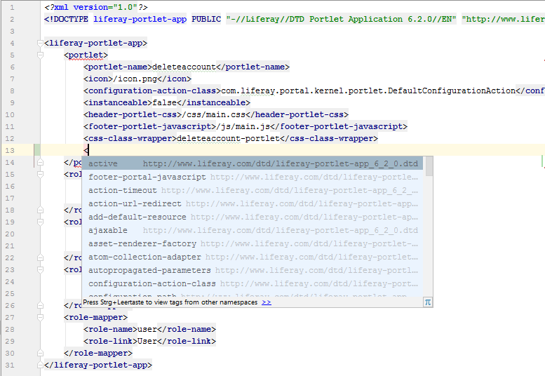

Liferay XML files
=================

1. [XML-Schemas and DTD files](#xml-schemas-and-dtd-files)
2. [File References](#file-references) 

XML-Schemas and DTD files
-------------------------

The plugin provides known XML-Schema and DTD files for Liferay 6.x and 7.x. This way you have XSD-/DTD-based code completion in all Liferay XML files.



Additionally the plugin provides XML-Schemas for ```portlet-model-hints.xml```, ```custom-sql/default.xml``` and `portlet-display-templates.xml` 

File References
---------------

In several XML tags you can provide a file name or path. This plugin is able to resolve those paths and link to
the appropriate files.

The following tags and attributes are supported:

    liferay-hook.xml
        <portal-properties>
        <language-properties>
        <custom-jsp-dir>

    liferay-layout-templates.xml
        <template-path>
        <wap-template-path>
        <thumbnail-path>
        <screenshot-path>

    liferay-look-and-feel.xml
        <root-path>
        <templates-path>
        <css-path>
        <images-path>
        <javascript-path>
        <color-scheme-images-path>
        <template-path>
        <wap-template-path>
        <thumbnail-path>
        <portlet-decorator-thumbnail-path>

    liferay-portlet.xml
        <friendly-url-routes>
        <header-portal-css>
        <header-portlet-css>
        <header-portal-javascript>
        <header-portlet-javascript>
        <footer-portal-css>
        <footer-portlet-css>
        <footer-portal-javascript>
        <footer-portlet-javascript>
        <icon>
        <user-notification-definitions>

    default.xml
        <resource file="">
        
    service.xml
        <service-builder-import file="">
    
    liferay-theme-loader.xml
        <themes-path>

    portlet-display-templates.xml
        <script-file>