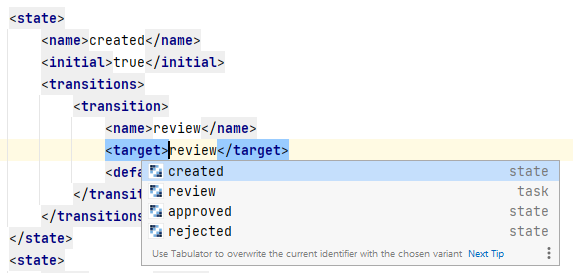

Liferay XML files
=================

1. [XML-Schemas and DTD files](#xml-schemas-and-dtd-files)
2. [File References](#file-references) 
3. [Liferay Workflow Definitions](#liferay-workflow-definitions) 
4. [Deprecations](#deprecations)
5. [XPath Expressions](#xpath-expressions)

XML-Schemas and DTD files
-------------------------

The plugin provides known XML-Schema and DTD files for Liferay 6.x and 7.x. This way you have XSD-/DTD-based code completion in all Liferay XML files.


Additionally, the plugin provides XML-Schemas for ```portlet-model-hints.xml```, ```custom-sql/default.xml``` and `portlet-display-templates.xml`

Inside custom sql files the content of the `<sql>` tag is recognized as SQL language, so code completion
is available here.

File References
---------------

In several XML tags you can provide a file name or path. This plugin is able to resolve those paths and link to
the appropriate files.

The following tags and attributes are supported:

    liferay-hook.xml
        <portal-properties>
        <language-properties>
        <custom-jsp-dir>

    liferay-layout-templates.xml
        <template-path>
        <wap-template-path>
        <thumbnail-path>
        <screenshot-path>

    liferay-look-and-feel.xml
        <root-path>
        <templates-path>
        <css-path>
        <images-path>
        <javascript-path>
        <color-scheme-images-path>
        <template-path>
        <wap-template-path>
        <thumbnail-path>
        <portlet-decorator-thumbnail-path>

    liferay-portlet.xml
        <friendly-url-routes>
        <header-portal-css>
        <header-portlet-css>
        <header-portal-javascript>
        <header-portlet-javascript>
        <footer-portal-css>
        <footer-portlet-css>
        <footer-portal-javascript>
        <footer-portlet-javascript>
        <icon>
        <user-notification-definitions>

    default.xml
        <resource file="">
        
    service.xml
        <service-builder-import file="">
    
    liferay-theme-loader.xml
        <themes-path>

    portlet-display-templates.xml
        <script-file>

Liferay Workflow Definitions
----------------------------

For workflow definition files the XML tags `<script>` and `<template>` are examined. If
the corresponding `<script-language>` or `<template-language>` is present and a proper language is defined
the language is injected into the tags above. 

So if the `<script-language>` defines that *groovy* is being used in `<script>` you can
use code completion, syntax checking and other groovy language features inside the `<script>`-Tag.

If specific language features are available in IntelliJ depends on if you installed and activated
the proper plugin for that language.

The following languages are supported for `<script-language>`:

* groovy
* java
* drl

The following languages are supported for `<template-language>`:

* freemarker
* velocity

For `<script>`-Tags containing groovy scripts the available context variables like `workflowContext` are detected, so
that code completion for those variables is available.

For `<template>`-Tags proper context variables are injected, so they can be used in Freemarker templates.

Additionally `<target>`-Tags, e.g. inside `<transition>`-Tags, are able to resolve possible targets within the
workflow definition files, like `<task>` or `<state>` elements.



Deprecations
------------

Liferay updates may remove or deprecate contents in XML files. Inspections are provided by this Plugin to check for deprecations and removals.

The following issues are detected and can be fixed automatically:

* Wrong DTD definition which do not match the Liferay version
* Wrong XML Schema references which do not match the Liferay version

XPath Expressions
-----------------

To process XML data Liferay provides some helper classes like `SAXReaderUtil`. Some of the methods support XPath expressions. In those methods 
an XPath Language injection takes places, so autocompletion and syntax checking works here. The following method signatures are supported:

    com.liferay.portal.kernel.xml.Node.matches()
    com.liferay.portal.kernel.xml.Node.numberValueOf()
    com.liferay.portal.kernel.xml.Node.selectNodes()
    com.liferay.portal.kernel.xml.Node.selectObject()
    com.liferay.portal.kernel.xml.Node.selectSingleNode()
    com.liferay.portal.kernel.xml.Node.valueOf()
    com.liferay.portal.kernel.xml.Document.matches()
    com.liferay.portal.kernel.xml.Document.numberValueOf()
    com.liferay.portal.kernel.xml.Document.selectNodes()
    com.liferay.portal.kernel.xml.Document.selectObject()
    com.liferay.portal.kernel.xml.Document.selectSingleNode()
    com.liferay.portal.kernel.xml.Document.valueOf()
    com.liferay.portal.kernel.xml.SAXReader.createXPath()
    com.liferay.portal.kernel.xml.SAXReader.selectNodes()
    com.liferay.portal.kernel.xml.SAXReader.sort()
    com.liferay.portal.kernel.xml.SAXReaderUtil.createXPath()
    com.liferay.portal.kernel.xml.SAXReaderUtil.selectNodes()
    com.liferay.portal.kernel.xml.SAXReaderUtil.sort()

The injection works for Java, Freemarker and Groovy scripts.
